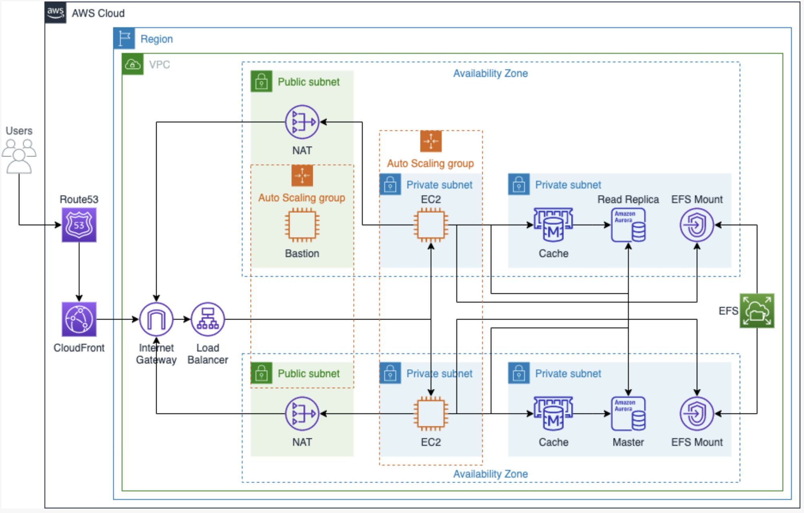

WORDPRESS WEBSITE IN AWS

==========================================================================================

This project deploys a dynamic WordPress website in AWS using various cloud technologies. The architecture includes multiple EC2 instances distributed across different Availability Zones (AZs) for fault tolerance and continuous operation. A NAT gateway is used to securely grant internet access to EC2 instances in private subnets, protecting them from direct exposure to the public internet. An Application Load Balancer (ALB) serves as a central entry gateway to efficiently distribute traffic between EC2 instances. Separate RDS instances are deployed in each AZ to ensure data redundancy. Amazon Elastic File System (EFS) is utilized as a shared non-volatile file system storage for WordPress files accessible by all EC2 instances.

All resources are encapsulated within dedicated subnets within a VPC (Virtual Private Cloud). Each resource is assigned its own security group to enforce granular access control. Route 53 is employed to manage the DNS domain name for the application.

Cloud Technologies: EC2, RDS, EFS, VPC, ALB, NAT, Route Table, Route 53, internet gateway, security groups, IAM, Terraform
Skills: Infrastructure as Code (Terraform), AWS Services, Cloud Architecture

==========================================================================================

